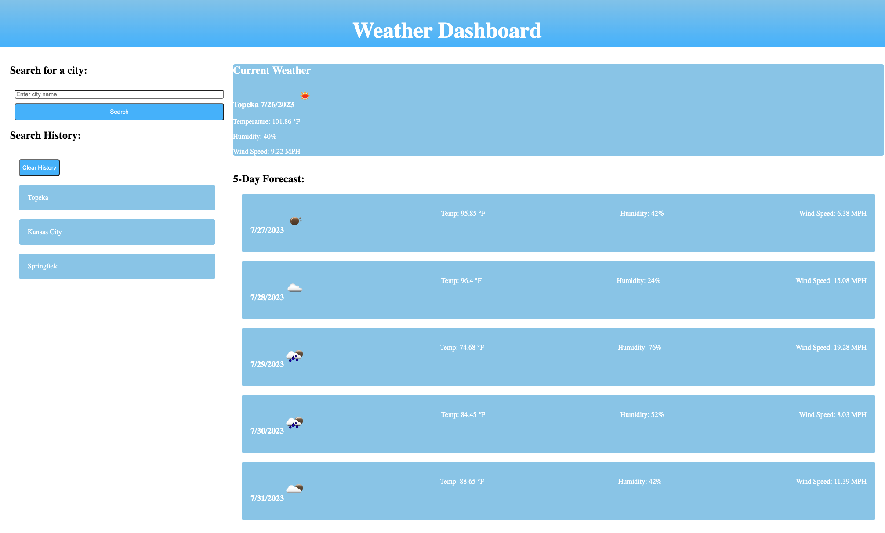

# Weather Dashboard

## Description
This webpage utilizes the OpenWeather API to search for a city and display the current weather
and additionally the forecast for the next 5 days.

## Installation
N/A

## Usage
To utilize this weather forecasting app click inside the search bar and enter the name of the
city you are looking for, the search is not case sensitive! Once you have entered the name
of the city you can either click the search button below the search bar or hit the enter key.
The relevant weather data will be displayed on the right hand side of the screen. The current
weather is displayed at the top and labeled current weather while the future forecast is
displayed in individual cards under the "5-Day Forecast:" label. Weather information that is
displayed includes: Temperature, Humidity, and Wind Speed.

The cities you search for are saved locally and will be loaded each time you visit the site.
You can click on a previously searched for city to load upto date information or click the 
"Clear History" button to clear your search history.

## Credits
This project makes use of jQuery, Day.js, and the OpenWeather APIs, information about these can
be found at the following sites respectively:

https://jquery.com/

https://day.js.org/

https://openweathermap.org/api

## License
Please refer to the LICENSE in the repo.
